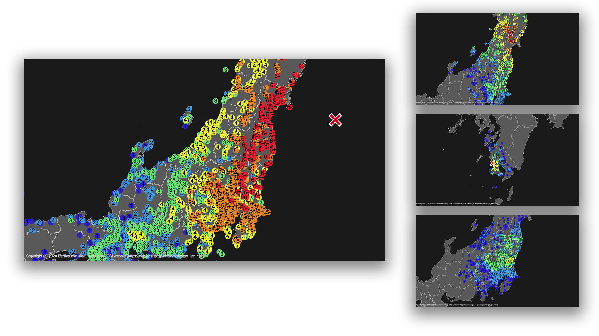

# Map draw


🇯🇵| [🇺🇸](documents/README_en.md)



## tl;dr

- 各地の震度、震源地をマップに描画する

## 使い方

### 💻インストール

必要なもの

- Node.js
- yarn

今回上記2つのインストール方法は割愛する。

```bash
# yarn、nodeはインストールされている状態とする
cd map-draw
yarn

# 実行（例）
node src/mapping.js -i test/example/example_1.json -o hoge.svg

```

- `--input`, `-i`
  - 震源地、各地の震度の情報（json形式）
  - フォーマットの解説は[こちら](#入力するファイルの形式)
- `--output`, `-o`
  - 生成後のファイルの保存先

### フォント

- Arial（フォント）

## 📒細かい設定

生成する画像サイズや倍率、色の変更は

[config/config.json](config/config.json)

で、設定します。

### フォーマット

- `width`
  - 生成する画像の横幅。Pixel
- `height`
  - 生成する画像の縦幅。Pixel
- `scale`
  - 倍率。桁が大きくなるほど拡大されます。
  - 拡大率が低い場合、自動的に解像度が低くなります。
    - `100 ≦ scale` で指定してください。
- `sea_color`
  - 海の色。
  - デフォルトは、  `#1a1a1a`
- `land_color`
  - 陸の色。
  - デフォルトは、  `#595959`
- `stroke_color`
  - 線の色。
  - デフォルトは、  `#ffffff`
- `map`
  - 使用する`geojson`ファイルのパス。
- `seismic_intensity_color`
  - 各震度の色
  - 詳しくは[こちら](#震度色とjsonの記述フォーマット)
- `epicenter`
  - `color`
    - 震源地の色
    - デフォルトは、  `#d10026`
  - `size`
    - 震源地に表示されるXマークの対照の線の長さ。
  - `stroke_width`
    - 震源地に表示されるXマークのストロークの横幅。
- `seismic_intensity`
  - `circle`
    - 震度の円の半径。
  - `fontsize`
    - 震度の数字のフォントサイズ。
  - `height`
    - 震度の文字と円がずれるため調整用。値が大きくなるごとに文字が下へずれます。
  - `width`
    - 震度の文字と円がずれるため調整用。値が大きくなるごとに文字が右へずれます。
  - `font`
    - フォント。デバイスにインストールされたフォントを指定してください。
- `copylight`
  - `text`
    - コピーライト文。配列として複数出力できます。フォントにより日本語を正しく表示できない場合があるので注意してください。
  - `size`
    - コピーライトのサイズ。
  - `color`
    - コピーライトの色。
    - デフォルトは、  `#c9c9c9`
  - `font`
    - フォント。デバイスにインストールされたフォントを指定してください。

## 📄入力するファイルの形式

`.json`で記述をします。

```json
{
    "epicenter": [
        // 経度, 緯度
    ],
    "areas": {
        // "震度": [[緯度, 経度], [経度, 緯度]]
        ...
    }
}
```

- `epicenter`
  - 震源地の緯度、経度を指定します。
  - 例:

    ```json
    "epicenter": [
        139.752273,
        35.684350
    ]
    ```

- `areas`
  - 各地ごとの震度
    - 震度表記は`0, 1, 2, 3, 4, under_5, over_5, under_6, over_6, 7`で記述してください。詳しくは[こちら](#震度色とjsonの記述フォーマット)
  - 例:

    <details>
    <summary>押して展開</summary>

    ```json
     "areas": {
        "4": [
            [
                144.3778,
                42.9867
            ],
            [
                143.8317,
                42.9050
            ],
            [
                145.5856,
                43.3309
            ],
        ],
        "3": [
            [
                143.2121,
                42.9226
            ],
            [
                143.9037,
                43.8181
            ],
            [
                143.6154,
                43.7885
            ],
            [
                143.9069,
                43.9726
            ],
            [
                144.1070,
                43.8238
            ],
            [
                144.6707,
                43.9115
            ],
        ]
    ```

    </details>

### サンプルコード

- [test/example/example_1.json](test/example/example_1.json)

## SVGからpngに変換する

```bash
node src convert -i [input file path] -o [output file path]
```

- `--input`, `-i`
  - SVG形式のファイルのパス・
- `--output`, `-o`
  - 生成後のpngファイルの保存先のパス

## 🎨震度色とJsonの記述フォーマット

   | Jsonでの呼び名 |  名前   |                                     色                                     |
   | :------------: | :-----: | :------------------------------------------------------------------------: |
   |      `0`       |  震度0  |  `#d9d9d9` |
   |      `1`       |  震度1  |  `#2d1fcc` |
   |      `2`       |  震度2  |  `#3b93db` |
   |      `3`       |  震度3  |  `#67e071` |
   |      `4`       |  震度4  |  `#e2eb38` |
   |   `under_5`    | 震度5弱 |  `#e38227` |
   |    `over_5`    | 震度5強 |  `#e38227` |
   |   `under_6`    | 震度6弱 |  `#e81c2d` |
   |    `over_6`    | 震度6強 |  `#e81c2d` |
   |      `7`       |  震度7  |  `#db1d95` |

## 🙇謝辞

以下の記事を参考にさせていただきました。ありがとうございます。

- [気象庁防災情報XMLとD3.jsを使って地震の震度分布図を作る](https://qiita.com/icchi_h/items/bbf563e1a7acec97a0e0)
- [d3.js + jsdomで国土地理院のベクトルタイルからSVGファイルを生成](https://qiita.com/cieloazul310/items/a8e776bbe8a70262df99)

色調は、[特務機関NERV防災](https://nerv.app/)を参考にさせていただきました。ありがとうございます。

## ⚖ライセンス

[MITライセンス](LICENSE)上で公開しています。
