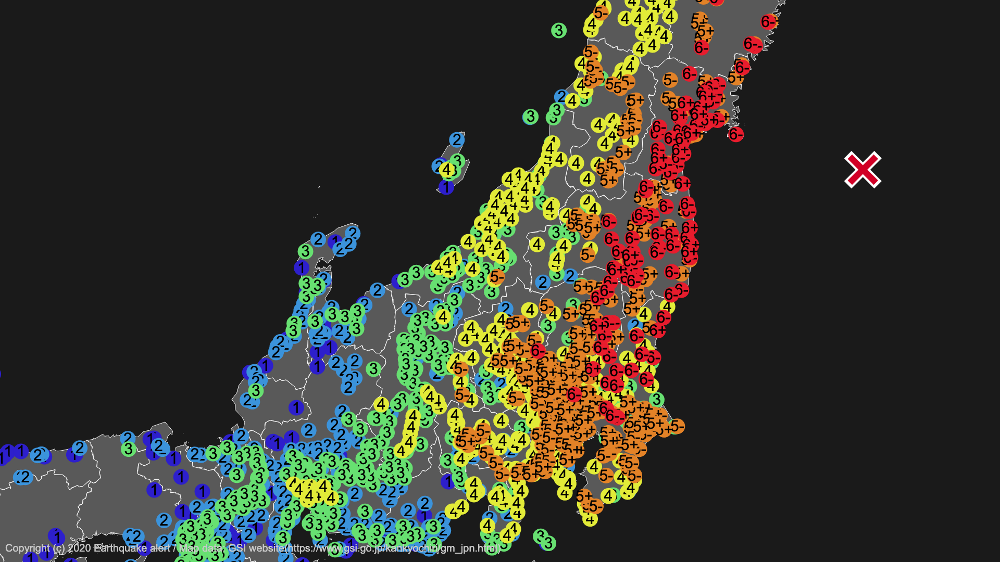
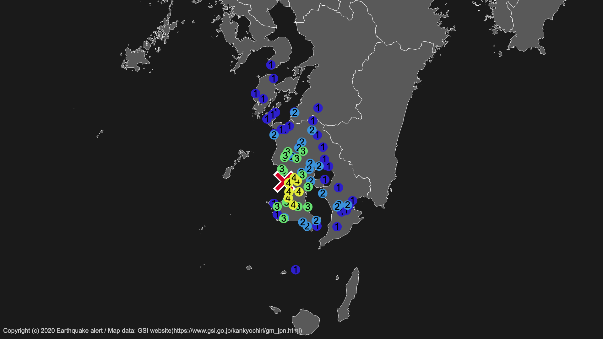
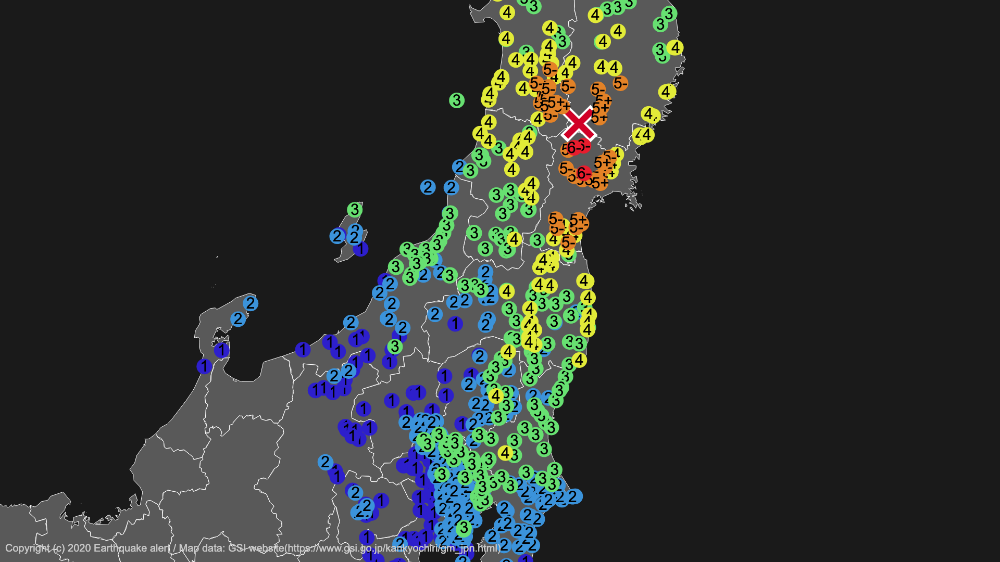
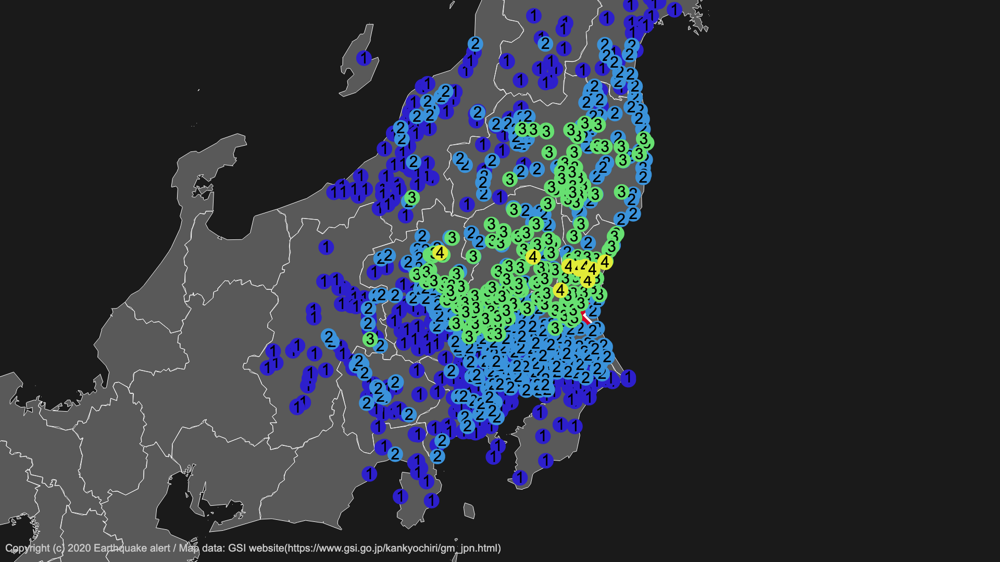

# Map draw


[🇯🇵](../README.md)| 🇺🇸




## tl;dr

- Generate png images of the seismic intensity distribution

## 💻Usage

### Install

What you need.

- Node.js
- yarn

I'll leave out the above two installation methods this time.

```bash
# yarn and node are assumed to be installed.
cd map-draw
yarn

# Run (examlple)
node src/mapping.js -i test/example/example_1.json -o hoge.svg -c config/config.json

```

- `--input`, `-i`
  - Information on the epicenter and seismic intensity in each area (JSON format)
  - The format is explained [here](#Type-of-file-to-enter).
- `--output`, `-o`
  - Where to save files after generation
- `--config`, `-c`
  - path of config.

### Font

- Arial（You can change this in config.）

## 📒Fine-tuning

You can change the size, magnification, and color of the generated image by

[config/config.json](../config/config.json)

### Format

- `width`
  - The width of the generated image, Pixel.
- `height`
  - The height of the generated image, Pixel.
- `scale`
  - Magnification. The larger the digit, the larger it will be.
  - If the magnification is low, the resolution will automatically be lower.
- `sea_color`
  - Color of sea.
  - The default is  `#1a1a1a`
- `land_color`
  - Color of land.
  - The default is  `#595959`
- `stroke_color`
  - Color of stroke.
  - The default is  `#ffffff`
- `map`
  - The path to the `geojson` file to use.
- `seismic_intensity_color`
  - Color of each seismic intensity
  - For more information, please click [here](#Seismic-intensity-color-and-Json-description-format).
- `epicenter`
  - `color`
    - Color of the epicenter
    - The default is   `#d10026`
  - `size`
    - The length of the contrasting line of the X mark that appears at the epicenter.
  - `stroke_width`
    - The width of the stroke of the X mark displayed at the epicenter.
- `seismic_intensity`
  - `circle`
    - The radius of the circle of seismic intensity.
  - `fontsize`
    - Font size of the seismic intensity figures.
  - `height`
    - For adjusting the seismic intensity because the circle and the letter of the seismic intensity are shifted.
    - Each time the value is increased, the character is shifted downward.
  - `width`
    - For adjusting the seismic intensity because the circle and the letter of the seismic intensity are shifted.
    - Each time the value is increased, the character is shifted to the right.
  - `font`
    - Font. Specify the font that is installed on the device.
- `copyright`
  - `text`
    - Copywritten statement.
    - Multiple outputs can be made as arrays.
    - Please note that some fonts may not be able to display Japanese correctly.
  - `size`
    - Copyright size.
  - `color`
    - Color of copyright.
    - The default is  `#c9c9c9`
  - `font`
    - Font. Specify the font that is installed on the device.

## 📄Type of file to enter

You can use `.json` to write a description.

```json
{
    "epicenter": [
        longitude, latitude
    ],
    "areas": {
        "Seismic intensity": [
          [longitude, latitude],
          [longitude, latitude]
          ...
        ]
        ...
    }
}
```

- `epicenter`
  - Specify the longitude and latitude of the epicenter.
  - Make sure that the **longitude** comes first.
  - Example:

    ```json
    "epicenter": [
        139.752273,
        35.684350
    ]
    ```

- `areas`
  - Seismic intensity in each area
    - The seismic intensity should be written as `0, 1, 2, 3, 4, under_5, over_5, under_6, over_6, 7`. For more information, please click [here](#Seismic-intensity-color-and-Json-description-format).
  - for example:

    <details>
    <summary>Click</summary>

    ```json
     "areas": {
        "4": [
            [
                144.3778,
                42.9867
            ],
            [
                143.8317,
                42.9050
            ],
            [
                145.5856,
                43.3309
            ],
        ],
        "3": [
            [
                143.2121,
                42.9226
            ],
            [
                143.9037,
                43.8181
            ],
            [
                143.6154,
                43.7885
            ],
            [
                143.9069,
                43.9726
            ],
            [
                144.1070,
                43.8238
            ],
            [
                144.6707,
                43.9115
            ],
        ]
    ```

    </details>

### Sample codes

- [test/example/example_1.json](../test/example/example_1.json)
- [test/example/example_2.json](../test/example/example_2.json)
- [test/example/example_3.json](../test/example/example_3.json)
- [test/example/example_4.json](../test/example/example_4.json)
- [test/example/example_5.json](../test/example/example_5.json)
- [test/example/example_6.json](../test/example/example_6.json)
- [test/example/example_7.json](../test/example/example_7.json)
- [test/example/example_8.json](../test/example/example_8.json)
- [test/example/example_9.json](../test/example/example_9.json)
- [test/example/example_10.json](../test/example/example_10.json)

## Convert SVG to png

```bash
node src convert -i [input file path] -o [output file path]
```

- `--input`, `-i`
  - The path of the SVG file.
- `--output`, `-o`
  - Path to the destination of the generated PNG file.

## 🎨Seismic intensity color and Json description format

   | Naming in Json | Name  |                                   Color                                    |
   | :------------: | :---: | :------------------------------------------------------------------------: |
   |      `0`       |   0   |  `#d9d9d9` |
   |      `1`       |   1   |  `#2d1fcc` |
   |      `2`       |   2   |  `#3b93db` |
   |      `3`       |   3   |  `#67e071` |
   |      `4`       |   4   |  `#e2eb38` |
   |   `under_5`    |  5-   |  `#e38227` |
   |    `over_5`    |  5+   |  `#e38227` |
   |   `under_6`    |  6-   |  `#e81c2d` |
   |    `over_6`    |  6+   |  `#e81c2d` |
   |      `7`       |   7   |  `#db1d95` |

## 🙇thanks

I referred to the following article as a reference. Thank you very much.

- [気象庁防災情報XMLとD3.jsを使って地震の震度分布図を作る](https://qiita.com/icchi_h/items/bbf563e1a7acec97a0e0)
- [d3.js + jsdomで国土地理院のベクトルタイルからSVGファイルを生成](https://qiita.com/cieloazul310/items/a8e776bbe8a70262df99)

The color scheme is based on the [NERV disaster management system](https://nerv.app/). Thank you very much.

## ⚖License

Published under the [MIT license](../LICENSE).

The map used in this page is based on "Global Map Japan" by Geographical Survey Institute, Ministry of Land, Infrastructure, Transport and Tourism, converted to geojson format.
